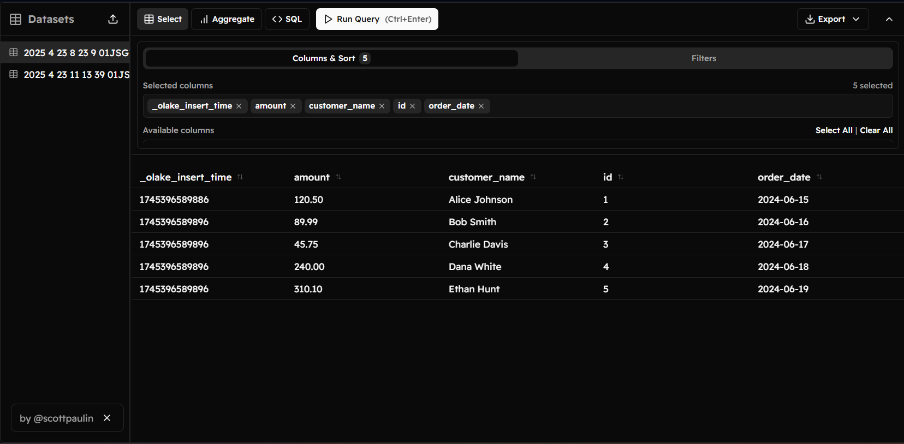

# MySQL Data Replication to Parquet

This project demonstrates how to replicate data from a MySQL database to Parquet files using olakego containers.

## Instructions

Copy and paste each command from below into your PowerShell terminal:

```powershell
# Stop the MySQL container if it's already running
docker stop mysql-olake

# Remove the existing MySQL container
docker rm mysql-olake

# Start a new MySQL container with a custom configuration
docker run --name mysql-olake -e MYSQL_ROOT_PASSWORD=root -e MYSQL_DATABASE=shop_db -p 3306:3306 -v "${pwd}/my.cnf:/etc/mysql/conf.d/my.cnf" -d mysql:latest

# Check that the container is running
docker ps

# Wait for MySQL to fully initialize (20 seconds)
Start-Sleep -Seconds 20

# Create the orders table in the database
docker exec -i mysql-olake mysql -uroot -proot -e "USE shop_db; CREATE TABLE IF NOT EXISTS orders (id INT AUTO_INCREMENT PRIMARY KEY, customer_name VARCHAR(100), amount DECIMAL(10, 2), order_date DATE);"

# Insert sample data into the orders table
docker exec -i mysql-olake mysql -uroot -proot -e "USE shop_db; INSERT INTO orders (customer_name, amount, order_date) VALUES ('Alice Johnson', 120.50, '2024-06-15'), ('Bob Smith', 89.99, '2024-06-16'), ('Charlie Davis', 45.75, '2024-06-17'), ('Dana White', 240.00, '2024-06-18'), ('Ethan Hunt', 310.10, '2024-06-19');"

# Verify the data was inserted correctly
docker exec -i mysql-olake mysql -uroot -proot -e "USE shop_db; SELECT * FROM orders;"

# Get the MySQL container's IP address
$mysqlIP = docker inspect -f '{{range .NetworkSettings.Networks}}{{.IPAddress}}{{end}}' mysql-olake

# Display the MySQL container's IP address
Write-Host "MySQL container IP: $mysqlIP"

# Get the current directory path in the correct format
$currentPath = (Get-Location).Path.Replace('\', '/')

# Run the discovery process to create a catalog of available tables
docker run --pull=always --network=bridge -v "${currentPath}:/mnt/config" olakego/source-mysql:latest discover --config /mnt/config/config.json

# Run the sync process to replicate the data to Parquet files
docker run --network=bridge -v "${currentPath}:/mnt/config" olakego/source-mysql:latest sync --config /mnt/config/config.json --catalog /mnt/config/catalog.json --destination /mnt/config/writer.json
```

## Project Structure

```
.
├── txt                # PowerShell commands for the demo
├── README.md         # This file
├── state.json        # State tracking for incremental syncs
├── output/           # Directory where Parquet files are stored
├── logs/             # Log files directory
├── catalog.json      # Stream catalog configuration
├── config.json       # MySQL connection configuration
├── writer.json       # Output configuration for Parquet files
└── my.cnf            # MySQL configuration file
```

## Prerequisites

- Docker Desktop installed and running
- PowerShell 5.1 or later


### Parquet Files 



## Challenges Faced

During the development of this project, I encountered several challenges:

1. **Integration Issues with Iceberg Format**
   - Initial attempts focused on using Apache Iceberg for better schema evolution support
   - Faced difficulties with catalog service integration and metadata management

2. **Spark SQL Configuration Problems**
   - Tried setting up Spark SQL to directly query the generated data
   - Encountered configuration issues with the Spark cluster and driver settings

3. **Docker Networking Issues**
   - Troubleshooting connection issues between Docker containers and the host system
   - Needed to ensure proper network configuration for container communication

4. **Time Constraints**
   - Limited time available due to concurrent class schedules
   - Had to prioritize a working solution over additional features

## Future Incremental Syncs

For incremental syncs after the initial replication:

```powershell
$path = (Get-Location).Path.Replace('\', '/'); docker run --network=bridge -v "${path}:/mnt/config" olakego/source-mysql:latest sync --config /mnt/config/config.json --catalog /mnt/config/catalog.json --destination /mnt/config/writer.json --state /mnt/config/state.json
```

## Troubleshooting

- If the MySQL container IP changes, update the "hosts" field in config.json
- Check the logs directory for detailed error information
- Ensure Docker network settings allow communication between containers 